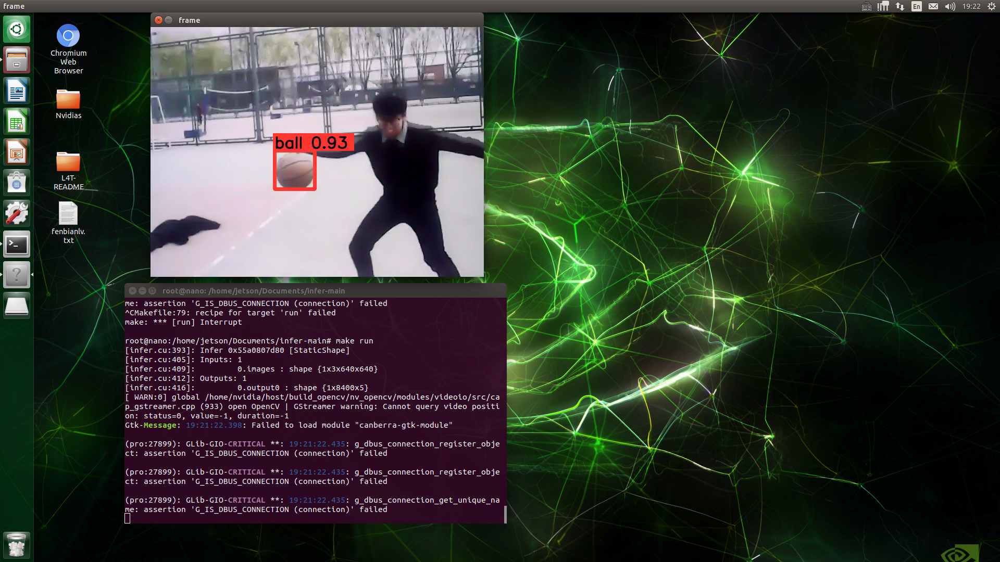

  

~时间太久远了，回忆录~
- [x] 效果还ok 

## 介绍
嫖了块Jetson nano,部署了自己随意训练的一个小模型，外接了显示器和usb摄像头.

## 准备工作
* [先刷鸡](https://developer.nvidia.com/embedded/learn/get-started-jetson-nano-devkit)

## 使用流程
+ 先跑一下demo熟悉，[Hello AI World](https://github.com/dusty-nv/jetson-inference),YouTuBe上有视频
+ 

## 其他问题
1. 跑demo的时候，摄像头调用问题
2. 

 

## Reference

