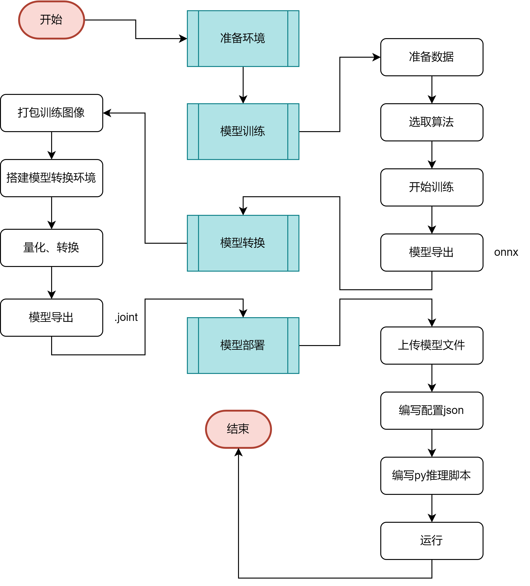

<p align="left">
  <a href [https://github.com/XianYang2547]">
  </a>

<p align="center">记录AX620A使用</p>

## 目录
```
.
├─config
│  └─config.prototxt                         根据官网说明配置
│  └─config_out.prototxt
├─dataset                                    
│  └─test.tar                                数据集
├─gt
├─images
│  └─3799794b483fc2b50a985d167fbfd893.jpeg   几张图像
│  └─....
├─model                                       
   └─best.onnx                               训练后转换的onnx文件
   └─ball.lava_joint
   └─ball.joint                              转为AX620A需要的joint模型文件
```

## 流程

<p align="center"> 

</p>

## 说明
1. 

## 结果

## Reference
- [AXera-Pi爱芯派](https://wiki.sipeed.com/ai/zh/deploy/ax-pi.html)
- [AXear Pulsar工具链](https://pulsar-docs.readthedocs.io/zh_CN/latest/)


