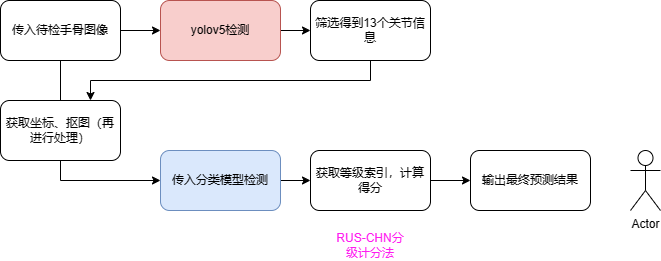
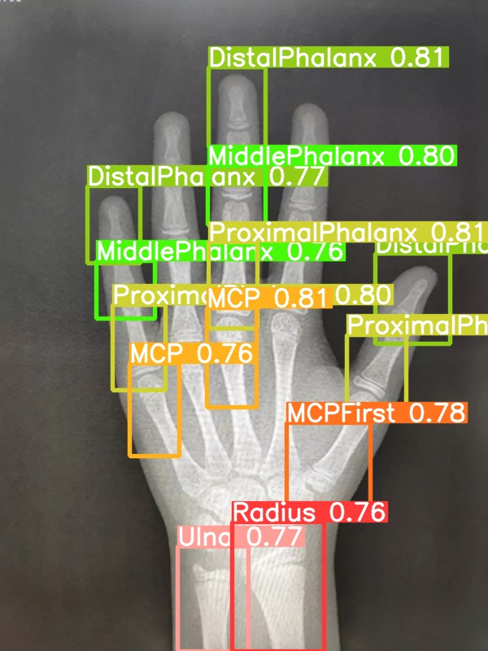
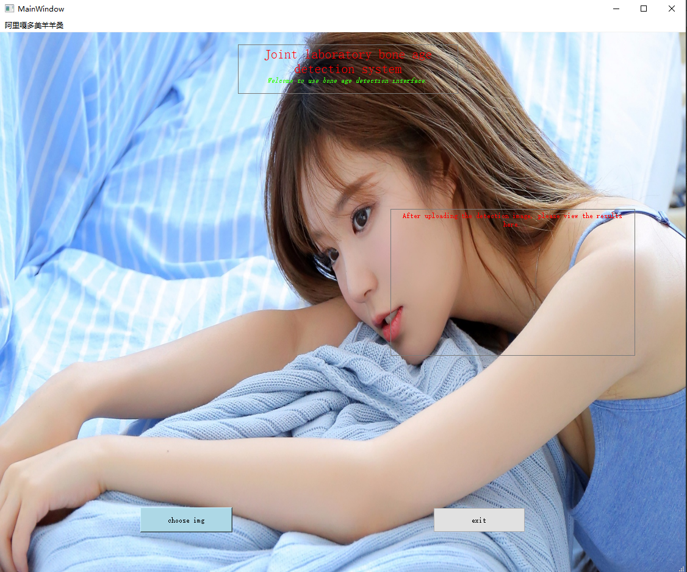

  

  总体描述就是：下载yolov5源码数据集，进行处理（直方图均衡化，旋转等），使用yolov5检测出手部骨头，然后进一步筛选。使用143M的那个数据集训练9个小模型（残差18），将筛选出的骨节送入小模型计算等级得分，得出骨龄。做了简单的PYQT界面，选择本地图像，选择性别，后台加载模型，显示出检测结果。
  （两个ymal文件放到data和models下，预训练模型下载，更改模块导入路径，detect.py 139行对结果进行筛选，my_bone_age放到源码里面，调用my——utils.py里面的函数对数据进行处理）

[下载数据和模型](https://pan.baidu.com/s/1VLb-wDaLkiQQA-DD_zyQEA?pwd=2547)
### 流程如下
  
### 结果
  
### PYQT界面
  
